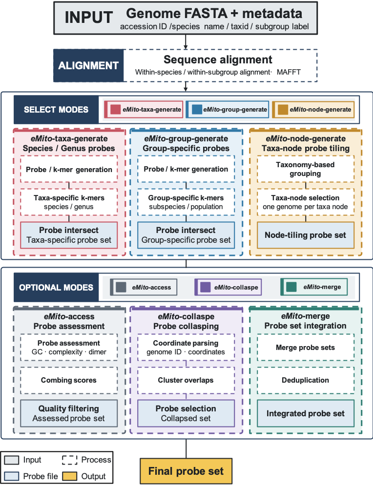
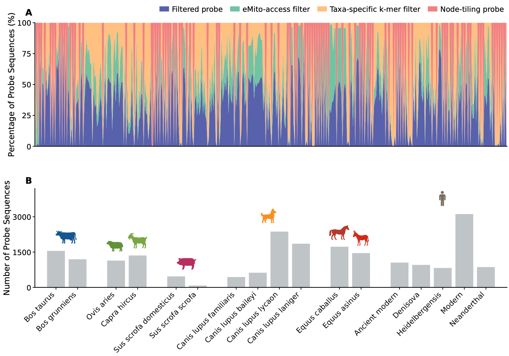

# eMito — Taxonomy-aware mitochondrial capture probe design

eMito is a command-line toolkit for designing mitochondrial capture probes for
ancient DNA, environmental DNA, and comparative mitogenomics. It combines
within-taxon sequence alignment, representative k-mer discovery, taxonomic
specificity, probe assessment, overlap collapsing, and final probe-set
integration in one reproducible workflow.

[](LICENSE)



## Modes

| Mode | Purpose | Input unit |
|---|---|---|
| `taxa` | Per-species probes filtered by species- and genus-specific k-mers | Genomes directly assigned to each species |
| `group` | Subspecies- or population-specific probes | Genomes with a non-empty subgroup label |
| `node` | Taxonomy-node tiling | One selected mitogenome per requested taxonomic node |
| `access` | GC, complexity, and dimer assessment | Each generated target probe FASTA independently |
| `collapse` | Coordinate-aware probe collapsing | Each target probe FASTA independently |
| `merge` | Integrate terminal mode outputs | All selected probe FASTA files; final dedup is optional |

## Installation

eMito requires Python 3.9 or later and [MAFFT](https://mafft.cbrc.jp/alignment/software/).
The Python package itself uses only the standard library.

```bash
git clone https://github.com/YCWangLab/eMito.git
cd eMito
python -m pip install -e .
emito info
```

Install MAFFT with Conda if it is not already available:

```bash
conda install -c bioconda mafft
```

## Input

### Genome FASTA

Place one mitochondrial genome per FASTA file. Each file must contain exactly
one record and be named `<accession_id>.fasta`:

```text
fasta/
├── NC_012920.1.fasta
├── NC_002008.4.fasta
└── ...
```

Records shorter than `--min-genome-length` (10,000 bp by default) are excluded
before alignment and all probe-design modes. Windows containing characters
other than A, T, C, or G are removed.

### Metadata

Metadata is a tab-separated file with four required columns:

```text
accession_id    species_name    taxid    subgroup_label
```

| Column | Meaning |
|---|---|
| `accession_id` | Accession matching `<accession_id>.fasta` |
| `species_name` | NCBI scientific species name; subspecies/populations map to their parent species |
| `taxid` | Actual NCBI TaxID for the record; it is not replaced by the species TaxID |
| `subgroup_label` | Subspecies/population name; leave empty for a species-level genome |

Example:

```text
accession_id    species_name    taxid    subgroup_label
NC_012920.1     Homo sapiens    9606
NC_002008.4     Canis lupus     9615     Canis lupus familiaris
```

The `subgroup_label` controls mode membership:

- `taxa` uses all genomes whose subgroup label is empty. These are the FASTA
  files directly under a species directory. If a species also contains
  subgroup genomes, its direct species-level genomes still participate in
  `taxa`; only the subgroup genomes are excluded from that mode.
- `group` uses all genomes whose subgroup label is non-empty.
- `node` uses all length-qualified genomes, including subgroup genomes.

### NCBI taxonomy

Download `names.dmp` and `nodes.dmp` from the
[NCBI taxdump archive](https://ftp.ncbi.nlm.nih.gov/pub/taxonomy/taxdump.tar.gz).
eMito maps every input TaxID to its species, genus, and requested node rank and
checks the metadata species name against the NCBI scientific name.

## Quick start

Validate inputs without generating output:

```bash
emito validate \
  --metadata metadata.tsv \
  --fasta-dir fasta \
  --names-dmp taxdump/names.dmp \
  --nodes-dmp taxdump/nodes.dmp
```

Run the default workflow:

```bash
emito run \
  --metadata metadata.tsv \
  --fasta-dir fasta \
  --names-dmp taxdump/names.dmp \
  --nodes-dmp taxdump/nodes.dmp \
  --output-root emito_output \
  --threads 4
```

Default generation modes are `taxa,group,node`. By default, `access` is run for
`taxa`; `collapse` is disabled for all three generation modes; final merge
deduplication is enabled.

### Important defaults

| Option | Default |
|---|---:|
| `--window-length` | 52 bp |
| `--probe-step` | 5 bp |
| `--kmer-step` | 1 bp |
| `--min-genome-length` | 10,000 bp |
| `--representative-fraction` | 0.75 |
| `--node-rank` | family |
| `--node-step` | 5 bp |
| `--taxa-access` | enabled |
| `--gc-min` / `--gc-max` | 35% / 65% |
| `--complexity-min` / `--complexity-max` | 0 / 2 |
| `--dimer-k` | 11 bp |
| `--dimer` | 0.15 |
| all other per-mode access/collapse switches | disabled |
| `--final-dedup` | enabled |

Run a taxa-only panel with per-species access and collapse:

```bash
emito run \
  --metadata metadata.tsv \
  --fasta-dir fasta \
  --names-dmp taxdump/names.dmp \
  --nodes-dmp taxdump/nodes.dmp \
  --output-root taxa_access_collapse \
  --modes taxa \
  --taxa-access \
  --taxa-collapse
```

Keep duplicate records during the final merge:

```bash
emito run ... --no-final-dedup
```

Use `emito run --help` for every parameter and its default.

## Generation logic

### Alignment and windows

Genomes are aligned within species or within subgroup. An `NC_` accession is
preferred as reference. eMito normalizes strand and circular origin, runs
MAFFT, and uses shared reference-alignment coordinates to generate independent
windows for every accession. Default windows are 52 bp, with probe step 5 and
k-mer step 1. Forward and reverse-complement k-mers are combined for presence
counting; probes are generated in the forward orientation.

### Representative k-mers

Representative k-mers must occur in:

| Number of genomes | Required presence |
|---:|---:|
| 1–3 | All genomes |
| 4 | 3 genomes |
| 5 | 4 genomes |
| >5 | At least 75% (rounded up) |

Repeated occurrences within one genome count as presence in one individual.

### `taxa`

For every species, eMito combines:

1. k-mers unique to that species among all species representative sets; and
2. k-mers unique to its genus among all genera, restricted back to that
   species' representative set.

The combined k-mers are intersected independently with every genome's probe
windows. Intersections from the same species are merged and deduplicated into
one Taxa-specific probe FASTA. Genus-specific k-mers are a filtering criterion;
they do not create separate genus probe output files.

### `group`

Representative k-mers are generated for every non-empty subgroup label.
K-mers present in only one subgroup representative set are intersected with
that subgroup's individual probe windows, then merged and deduplicated into one
Group-specific probe FASTA per subgroup. Specificity is evaluated globally
against every subgroup represented in the input metadata.

### `node`

Input genomes are grouped at `--node-rank` (`family` by default). One genome is
selected per node, preferring `NC_` accessions and using a reproducible random
seed when multiple candidates remain. The selected genome is tiled directly
with 52-bp probes at `--node-step 5` by default.

## Optional processing and final integration

`access` and `collapse` are applied independently to every target FASTA—not to
all species or groups merged together. If both are enabled, the order is:

```text
generation -> access -> collapse
```

Default `access` filters match the corresponding eProbe assessment settings:
GC 35–65%, DUST-like complexity 0–2, dimer k=11, and `--dimer 0.15`. The
dimer score measures reverse-complement k-mer complementarity between probes
that already passed GC and complexity filters; each probe's self-contribution
is subtracted. A dimer value between 0 and 1 selects the corresponding score
quantile as an inclusive cutoff, a value of 1 or greater is an absolute score
cutoff, and a value of 0 or less disables dimer filtering. Exact duplicate
sequences are then removed within each assessed target. `collapse` groups
probes by accession and greedily retains non-overlapping probes in coordinate
order.

The terminal output of each enabled generation mode is then merged. Exact
uppercase ATCG-sequence deduplication is enabled by default (`--final-dedup`)
and can be disabled with `--no-final-dedup`.

## Output

```text
emito_output/
├── 00_config.json
├── 00_input_qc/
├── 01_organized_genomes/
├── 02_alignments/
├── 02_windows/
├── 03_eMito_taxa_generate/
├── 04_eMito_group_generate/
├── 05_eMito_node_generate/
├── 06_optional_modes/
└── 07_final_probe_set/
    ├── final_probe_set.fasta
    └── input_probe_files.tsv
```

Only directories for enabled generation/optional modes are created, except
that common alignment/window preprocessing is shared by the generation modes.

## Summaries

```bash
# Generation/access/collapse/final-merge counts by mode
emito summarize --output-root emito_output

# Input genome, species, genus, and family counts
emito taxonomy-summary --output-root emito_output

# Detailed probe and k-mer counts at every stage
emito stage-summary --output-root emito_output

# Recompute and summarize the per-filter eMito-access counts
emito access-summary --output-root emito_output --mode taxa
```

## Figures and source data

The workflow and manuscript figures are stored in [`figures/`](figures/).
Their compact, tab-separated source tables are generated from a completed run
with [`scripts/export_publication_metadata.py`](scripts/export_publication_metadata.py);
see [`metadata/README.md`](metadata/README.md) for the expected files.



The genus-level distribution is provided as an editable vector figure:
[`final_probe_genus_tree.pdf`](figures/final_probe_genus_tree.pdf). Additional
evaluation figures include [`capture_vs_shotgun.pdf`](figures/capture_vs_shotgun.pdf),
[`pathphynder_ovis_bos.pdf`](figures/pathphynder_ovis_bos.pdf), and
[`rarefaction_ovis.pdf`](figures/rarefaction_ovis.pdf).

## Reproducibility

Every run records all resolved arguments in `00_config.json`. Alignment inputs,
MAFFT logs, normalization decisions, selected node genomes, target manifests,
and the exact terminal files used for the final merge are retained under the
output root.

## Tests

```bash
python -m unittest discover -s tests -v
```

The test suite uses a generated synthetic dataset and does not require a local
NCBI taxdump or a production MAFFT installation. See [`test_data/`](test_data/)
for the covered behavior. A ready-to-enable GitHub Actions workflow is provided
at [`examples/github-actions-tests.yml`](examples/github-actions-tests.yml).

## Citation

Manuscript in preparation. Please cite this GitHub repository until the paper
is published.

## Issues and contributions

Bug reports and pull requests are welcome through the
[issue tracker](https://github.com/YCWangLab/eMito/issues). See
[`CONTRIBUTING.md`](CONTRIBUTING.md) for development instructions.

## License

eMito is released under the [MIT License](LICENSE).
